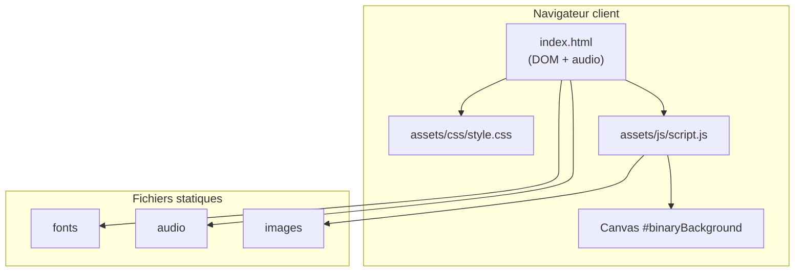

# Safenet

Application web **statique** : simulateur d’interface « hacking » pour un **escape game** autour de la cybersécurité, destiné à un public jeune en contexte d’animation (ex. événement, atelier sensibilisation).

---

## 1. Besoins du client

### Contexte et cible

Le besoin exprimé portait sur un **événement de sensibilisation à la cybersécurité** auprès de **jeunes** : il fallait un support numérique capable de matérialiser, de façon ludique et collective, la tension d’une **situation de crise cyber** sans utiliser d’outils réels d’attaque ou d’accès à des systèmes.

### Objectifs fonctionnels et pédagogiques


| Objectif                  | Description technique / pédagogique                                                                                                                                                                                                                                     |
| ------------------------- | ----------------------------------------------------------------------------------------------------------------------------------------------------------------------------------------------------------------------------------------------------------------------- |
| Scénario type escape game | Le dispositif incarne un **compte à rebours** et une interface « terminal » : les participants doivent **retrouver le mot de passe / code de désactivation** dans le **temps imparti** pour **mettre fin à la fiction du piratage** (arrêt du minuteur et du scénario). |
| Engagement du groupe      | **Retours visuels et sonores** (minuteur précis, console factice, fond animé) pour maintenir l’attention et le rythme en salle ou sur grand écran.                                                                                                                      |
| Pilotage par l’animateur  | **Paramétrage sans recompilation** : durée, secret de désactivation, pénalités en cas d’essais erronés — adaptables au niveau du groupe et au déroulé de l’atelier.                                                                                                     |
| Autonomie technique       | Solution **100 % client**, **sans backend** ni compte utilisateur : déploiement léger (fichiers statiques), adapté à un poste projeté ou une salle équipée d’un navigateur.                                                                                             |


### Problématiques initiales

- **Légitimité et cadre légal** : proposer une **mise en scène explicitement fictive**, sans connexion à des infrastructures réelles ni incitation à des comportements illicites ; l’outil sert le **discours pédagogique** (réaction face à une alerte, importance des mots de passe, gestion du stress, etc.).
- **Clarté pour le public jeune** : distinguer **jeu / simulation** et **cybersécurité réelle** ; le narratif « empêcher le hacking » reste **symbolique** et encadré par l’animation.
- **Fiabilité en conditions réelles d’événement** : installation rapide, peu de dépendances ; **audio** et affichage stables selon le navigateur et le mode de service (HTTP local vs `file://`).
- **Gestion du secret** : le code est une **énigme à résoudre dans le parcours** (indices, énigmes papier, etc.) tout en restant **configurable** côté animateur — avec les limites de sécurité propres à une appli entièrement côté client (voir § 3).

---

## 2. Architecture du projet

### 2.1 Pile technique


| Couche              | Technologies                                                                |
| ------------------- | --------------------------------------------------------------------------- |
| Structure           | HTML5, sémantique de base, éléments médias natifs (`<audio>`)               |
| Présentation        | CSS3 (flexbox, animations, `@font-face`)                                    |
| Comportement        | JavaScript ES6 (écouteurs d’événements, `CanvasRenderingContext2D`, timers) |
| Ressources externes | Google Fonts (Press Start 2P) — chargement HTTPS                            |


**Build** : aucun. **Runtime** : moteur JavaScript du navigateur uniquement.

### 2.2 Arborescence du dépôt

```
Safenet/
├── index.html                 # Document unique, point d’entrée HTTP
├── LICENSE
├── readme.md
└── assets/
    ├── css/
    │   └── style.css          # Thème, layout, animations
    ├── js/
    │   └── script.js          # Logique applicative monolithique (init au chargement DOM)
    ├── fonts/
    │   └── Open24DisplaySt.ttf
    ├── audio/
    │   ├── bip.wav
    │   ├── error.wav
    │   └── gameover.wav
    └── images/
        ├── fail.webp
        └── logo.png           # Référencé par le CSS (#logo) si intégré au HTML
```

### 2.3 Schéma logique (couches)




### 2.4 Modules fonctionnels côté code


| Zone DOM / fichier                | Responsabilité                                                  |
| --------------------------------- | --------------------------------------------------------------- |
| `#binaryBackground` + `script.js` | Pluie binaire animée (Canvas 2D, redimensionnement fenêtre)     |
| `#timer`, `#content`              | Affichage du compte à rebours et conteneur principal            |
| `#output-console`                 | Flux de lignes simulées type shell                              |
| `#terminal`, `#feedback`          | Saisie du code, validation, messages utilisateur                |
| `#adminPanel`                     | Configuration animateur (masquée par défaut, raccourci clavier) |


Le point d’exécution est la fonction `init()` dans `assets/js/script.js`, déclenchée sur `DOMContentLoaded` (ou immédiatement si le DOM est déjà prêt).

---

## 3. Cybersécurité

### 3.1 État actuel (limites assumées)

- **Aucune authentification** : le panneau d’administration est accessible via le raccourci clavier **Alt + A** ; toute personne connaissant ce raccourci peut modifier les paramètres en session.
- **Aucun serveur applicatif** : pas de base de données, pas d’API, pas de journalisation centralisée.
- **Logique et secrets côté client** : le code de désactivation et les réglages ne sont pas protégés par chiffrement ; ils sont visibles dans le code source et la mémoire du navigateur.
- **Dépendance réseau** : chargement optionnel de polices depuis `fonts.googleapis.com` (fuite d’information minimale : requête vers Google lors de la visite).

### 3.2 Mesures recommandées selon le contexte d’usage


| Contexte                               | Recommandation                                                                                                                                                                              |
| -------------------------------------- | ------------------------------------------------------------------------------------------------------------------------------------------------------------------------------------------- |
| Atelier jeunesse / escape game encadré | Documenter le raccourci admin **uniquement** pour les animateurs ; rappeler en amont que la scène est **fiction pédagogique** ; ne pas présenter l’outil comme un système de sécurité réel. |
| Déploiement public (URL ouverte)       | Remplacer le raccourci fixe par un **mot de passe ou code** configurable, ou retirer le panneau du livrable « joueur » et fournir une variante « animateur » séparée.                       |
| Réduction de la surface réseau         | Héberger localement la police Press Start 2P (auto-hébergement) pour supprimer l’appel à Google Fonts.                                                                                      |
| Durcissement général                   | Servir le site en **HTTPS**, en-têtes de sécurité adaptés (`Content-Security-Policy`, `X-Content-Type-Options`, etc.) sur le serveur web choisi.                                            |


> **Rappel pédagogique** : cette application est une **simulation visuelle et sonore**. Elle ne doit pas être utilisée pour la protection de données sensibles ni comme démonstration de sécurité réelle.

---

## 4. Hébergement

Le site est **hébergé sur [GitHub Pages](https://pages.github.com/)** : le dépôt sert des fichiers statiques (`index.html` à la racine, dossier `assets/`), sans build ni serveur applicatif. L’URL publique dépend des réglages du dépôt (onglet *Settings → Pages* sur GitHub).

---

## 5. Ce que fait l’application / le site

### 5.1 Parcours « joueur » (escape game)

Dans le **scénario pédagogique**, l’équipe dispose d’un temps limité pour **« désactiver l’attaque »** en trouvant le **mot de passe de désactivation** (découvert via le parcours d’énigmes / consignes animateur). Côté logiciel, cela se traduit par :

- Un **compte à rebours** visible (heures : minutes : secondes : **centièmes**), renforcé sous la dernière minute par un **bip** chaque seconde et un style d’alerte.
- Une **console factice** qui défile des lignes type shell pour renforcer l’immersion « système en cours d’intrusion » tant que le chrono tourne.
- Un **fond binaire animé** (canvas plein écran) avec variations visuelles en cas de stress (erreurs, fin de temps).
- Un **champ de saisie** : si le code saisi correspond (après trim) au paramètre animateur, le minuteur et la fiction s’**arrêtent sur une réussite** ; sinon, **pénalité** sur le temps restant, son et effets d’alerte.
- Si le temps est écoulé **sans** bon code : fin de partie « échec » (sons, animations, image `fail.webp` possible, terminal masqué) — support de discussion pour l’animateur (gestion de crise, préparation, etc.).

### 5.2 Parcours « animateur »

En amont ou pendant l’événement, l’animateur règle le dispositif sans toucher au code source :

- **Alt + A** : affiche ou masque le panneau d’administration.
- Champs : durée (heures / minutes / secondes), **mot de passe de désactivation**, **pénalité** (secondes par défaut ; unité minutes possible si un sélecteur `#adminPenaltyUnit` est ajouté au DOM).
- Actions : **Démarrer** le minuteur, **Réinitialiser**, **Sauvegarder** les paramètres pour la **session** courante (mémoire volatile côté navigateur, pas de persistance serveur).

### 5.3 Paramètres par défaut (modifiables via l’admin)


| Paramètre | Valeur initiale |
| --------- | --------------- |
| Durée     | 60 minutes      |
| Code      | `netsafe`       |
| Pénalité  | 10 secondes     |
